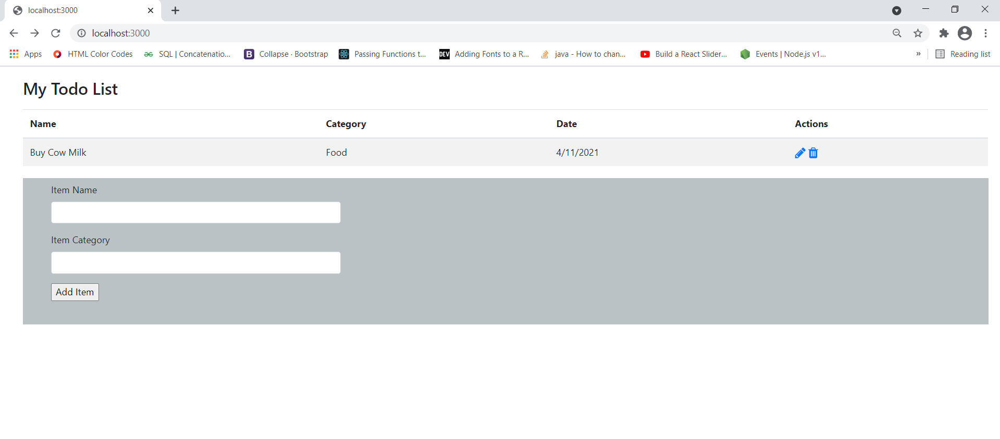

# Node.Js Complete Crud App - Todo List

This web app is implemented as a single-page application (SPA). Todo app is a great example of a project for implementation the four basic functions that models should be able to do, at most.Create, read, update and delete with Node.Js and MongoDB.
Mongoose Model is created through the Schema interface for interacting with MongoDB.  

 

## Requirments

* express @4.17.1
* mongoose @5.3.4
* ejs @3.1.6
* body-parser @1.19.0
* path @0.12.7

## Installation

Create a package.json file
```bash
npm init
```

This command prompts you for a number of things, such as the name and version of your application. For now, you can simply hit RETURN to accept the defaults.

After you create a package.json file, install Express in the project directory and save it in the dependencies list with the following command:

```bash
npm i --s express@4.17.1
```

Assuming you’ve already installed MongoDB, in command prompt enter the following command for installation a MongoDB object-mongoose:

```bash
npm install mongoose@5.3.4
```

You will need to install body parsing middleware as well, which is responsible for parsing the incoming request bodies in a middleware before you handle it.
```bash
npm install body-parser
```

To install a path module for handling and transforming file paths, perform the following command line:
```bash
npm install --s path
``` 

For this project you will need EJS templating language, which helps to embed JavaScript to HTML pages.
```bash
npm install ejs
```

To start the server, go to your terminal and type:
```bash
node index.js
```
This will start the server. This single-page application will listen on port 3000. 

If you want to avoid typing the previous command every time you save changes, I will advise you to install nodemon dependencies. It helps develop node.js based applications by automatically restarting the node application when file changes in the directory are detected.

## Usage

Include the express module in your main js file by typing the following code:

```python
const express = require('express')
```
Before you start using Express, you need to define an instance of it, which handles the request and response from the server to the client. In this case, it is the variable app.

```python
const app = express();
```

Now you could type the following code to check if everything is OK with the installation of needed packages.
```python
app.get('/', (req, res)=>{
    res.send('Hello World');
}) .listen(3000, ()=>{
    console.log('Server started on port 3000. Good luck!');
})
```
To start the server, go to your terminal and type:
```bash
node index.js
```
This will start the server. This single-page application will listen on port 3000. 
If everything is ok, you should see the message in your terminal: 
```python
Server started on port 3000. Good luck!
```
To include mongoose tool in our project, you need to type the following code:
```python
const mongoose = require('mongoose');
```
Considering that our app uses only one database, you should use mongoose.connect to define a connection. Connect take a mongoDB//URI, options and the callback function.
In the apart file called db you should define Model through the Schema interface and export it for use in the main file.
```python
const TodoSchema = mongoose.Schema({
    itemName: {
        type: String
    },
    itemCategory: {
        type: String
    },
    date: {
        type: String
    }
}, {collection: 'todo-items'}
);
const model = mongoose.model('TodoModel', TodoSchema);
module.exports = model;
```
To import created model from db.js file, use the following code:
```python
const Todos = require('./models/db');
```
In Studio 3T create new connection with the following data - name and DB server. After you create the connection, you need to add a database for storing data that are forward through input form.
      
Studio 3T is the professional IDE, client, and GUI for MongoDB. You could visit the following link for downloading this IDE. 
[Download Studio 3T](https://studio3t.com/download/)  
  
Code below are used to parse the incoming request bodies in a middleware before you handle it.

```python
const bodyParser = require('body-parser');
app.use(bodyParser.urlencoded({extended: true}));
app.use(bodyParser.json());
```
---


